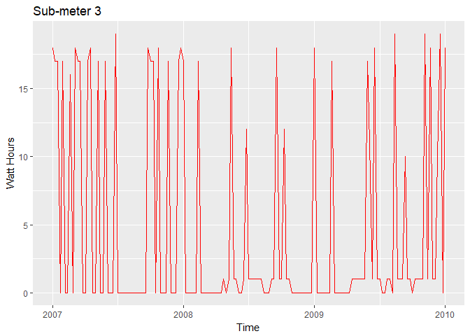
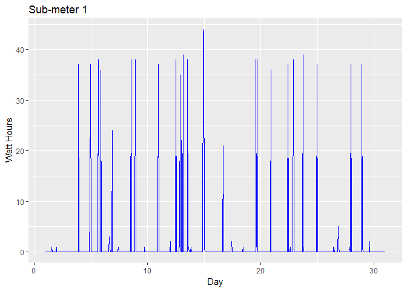
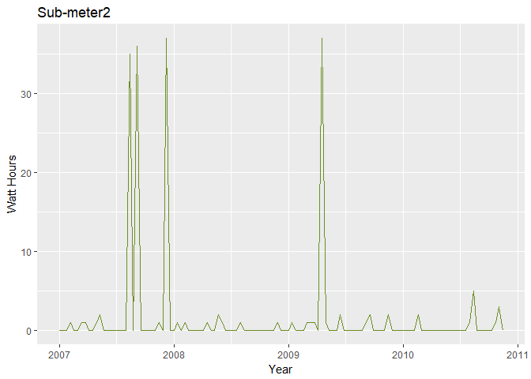

Energy Submetering
================
Eric Richter

-   [Importing the Data](#importing-the-data)
-   [Preprocessing](#preprocessing)
-   [Exploratory Data Analysis](#exploratory-data-analysis)
-   [Visualize the Data](#visualize-the-data)
-   [Prepare to Analyze the Data](#prepare-to-analyze-the-data)
-   [Forecasting](#forecasting)
-   [Decomposing Seasonal Time Series'](#decomposing-seasonal-time-series)
-   [Holt-Winters Forecasting](#holt-winters-forecasting)

In this project I'm developing analytics for a set of electircal sub-metering devices used for power management in Smart Homes. Installing such devices allows developers to offer highly efficient Smart Homes that provide owners with power usage analytics.

``` r
## Load required packages
library(RMySQL)
library(dplyr)
library(pastecs)
library(lubridate)
library(plotly)
```

Importing the Data
==================

The data is stored on a database in several annual tables (yr\_2006, yr\_2007, yr\_2008, yr\_2009, yr\_2010). I'm using the RMySQL package to query the database and retrieve the data. dbListFields allows me to see the attributes in the dataset.

``` r
## List the tables contatined in the database
dbListFields(con, "yr_2006")
```

    ##  [1] "id"                    "Date"                 
    ##  [3] "Time"                  "Global_active_power"  
    ##  [5] "Global_reactive_power" "Global_intensity"     
    ##  [7] "Voltage"               "Sub_metering_1"       
    ##  [9] "Sub_metering_2"        "Sub_metering_3"

Since this analysis will center around visualization and time series analysis of sub-meters, I don't need to import all of the data. Instead I'm only pulling the data for Date, Time, and the 3 sub-meter attributes.

``` r
## Pull the data for years 2006 - 2010 for Date, Time, and the three sub-meter attributes
yr_2006 <- dbGetQuery(con, "SELECT Date, Time, Sub_metering_1, Sub_metering_2, Sub_metering_3 FROM yr_2006")
yr_2007 <- dbGetQuery(con, "SELECT Date, Time, Sub_metering_1, Sub_metering_2, Sub_metering_3 FROM yr_2007")
yr_2008 <- dbGetQuery(con, "SELECT Date, Time, Sub_metering_1, Sub_metering_2, Sub_metering_3 FROM yr_2008")
yr_2009 <- dbGetQuery(con, "SELECT Date, Time, Sub_metering_1, Sub_metering_2, Sub_metering_3 FROM yr_2009")
yr_2010 <- dbGetQuery(con, "SELECT Date, Time, Sub_metering_1, Sub_metering_2, Sub_metering_3 FROM yr_2010")

## Investigation of the data frames
str(yr_2006)
```

    ## 'data.frame':    21992 obs. of  5 variables:
    ##  $ Date          : chr  "2006-12-16" "2006-12-16" "2006-12-16" "2006-12-16" ...
    ##  $ Time          : chr  "17:24:00" "17:25:00" "17:26:00" "17:27:00" ...
    ##  $ Sub_metering_1: num  0 0 0 0 0 0 0 0 0 0 ...
    ##  $ Sub_metering_2: num  1 1 2 1 1 2 1 1 1 2 ...
    ##  $ Sub_metering_3: num  17 16 17 17 17 17 17 17 17 16 ...

``` r
summary(yr_2006)
```

    ##      Date               Time           Sub_metering_1   Sub_metering_2  
    ##  Length:21992       Length:21992       Min.   : 0.000   Min.   : 0.000  
    ##  Class :character   Class :character   1st Qu.: 0.000   1st Qu.: 0.000  
    ##  Mode  :character   Mode  :character   Median : 0.000   Median : 0.000  
    ##                                        Mean   : 1.249   Mean   : 2.215  
    ##                                        3rd Qu.: 0.000   3rd Qu.: 1.000  
    ##                                        Max.   :77.000   Max.   :74.000  
    ##  Sub_metering_3 
    ##  Min.   : 0.00  
    ##  1st Qu.: 0.00  
    ##  Median : 0.00  
    ##  Mean   : 7.41  
    ##  3rd Qu.:17.00  
    ##  Max.   :20.00

``` r
head(yr_2006)
```

    ##         Date     Time Sub_metering_1 Sub_metering_2 Sub_metering_3
    ## 1 2006-12-16 17:24:00              0              1             17
    ## 2 2006-12-16 17:25:00              0              1             16
    ## 3 2006-12-16 17:26:00              0              2             17
    ## 4 2006-12-16 17:27:00              0              1             17
    ## 5 2006-12-16 17:28:00              0              1             17
    ## 6 2006-12-16 17:29:00              0              2             17

``` r
tail(yr_2006)
```

    ##             Date     Time Sub_metering_1 Sub_metering_2 Sub_metering_3
    ## 21987 2006-12-31 23:54:00              0              0              0
    ## 21988 2006-12-31 23:55:00              0              0              0
    ## 21989 2006-12-31 23:56:00              0              0              0
    ## 21990 2006-12-31 23:57:00              0              0              0
    ## 21991 2006-12-31 23:58:00              0              0              0
    ## 21992 2006-12-31 23:59:00              0              0              0

Next I need to create a multi-year data frame that will serve as the primary data frame for the project. The "bind\_rows" function from the dplyr package is an excellent way to accomplish this.

``` r
## Combine tables into one data frame using dplyr
all <- bind_rows(yr_2006, yr_2007, yr_2008, yr_2009, yr_2010)

## Investigage new primary data frame
str(all)
```

    ## 'data.frame':    2049280 obs. of  5 variables:
    ##  $ Date          : chr  "2006-12-16" "2006-12-16" "2006-12-16" "2006-12-16" ...
    ##  $ Time          : chr  "17:24:00" "17:25:00" "17:26:00" "17:27:00" ...
    ##  $ Sub_metering_1: num  0 0 0 0 0 0 0 0 0 0 ...
    ##  $ Sub_metering_2: num  1 1 2 1 1 2 1 1 1 2 ...
    ##  $ Sub_metering_3: num  17 16 17 17 17 17 17 17 17 16 ...

``` r
summary(all)
```

    ##      Date               Time           Sub_metering_1   Sub_metering_2  
    ##  Length:2049280     Length:2049280     Min.   : 0.000   Min.   : 0.000  
    ##  Class :character   Class :character   1st Qu.: 0.000   1st Qu.: 0.000  
    ##  Mode  :character   Mode  :character   Median : 0.000   Median : 0.000  
    ##                                        Mean   : 1.122   Mean   : 1.299  
    ##                                        3rd Qu.: 0.000   3rd Qu.: 1.000  
    ##                                        Max.   :88.000   Max.   :80.000  
    ##  Sub_metering_3  
    ##  Min.   : 0.000  
    ##  1st Qu.: 0.000  
    ##  Median : 1.000  
    ##  Mean   : 6.458  
    ##  3rd Qu.:17.000  
    ##  Max.   :31.000

``` r
head(all)
```

    ##         Date     Time Sub_metering_1 Sub_metering_2 Sub_metering_3
    ## 1 2006-12-16 17:24:00              0              1             17
    ## 2 2006-12-16 17:25:00              0              1             16
    ## 3 2006-12-16 17:26:00              0              2             17
    ## 4 2006-12-16 17:27:00              0              1             17
    ## 5 2006-12-16 17:28:00              0              1             17
    ## 6 2006-12-16 17:29:00              0              2             17

``` r
tail(all)
```

    ##               Date     Time Sub_metering_1 Sub_metering_2 Sub_metering_3
    ## 2049275 2010-11-26 20:57:00              0              0              0
    ## 2049276 2010-11-26 20:58:00              0              0              0
    ## 2049277 2010-11-26 20:59:00              0              0              0
    ## 2049278 2010-11-26 21:00:00              0              0              0
    ## 2049279 2010-11-26 21:01:00              0              0              0
    ## 2049280 2010-11-26 21:02:00              0              0              0

Preprocessing
=============

We can see that Date and Time are included as two separate attributes and are also classified as characters. In order to proceed with the analysis they need to be combined into one Date and Time attribute column and also converted to the POSIXct data type.

``` r
## Combine Date and Time attribue values into a new attribute column, name it, and move it within the dataset
main <- cbind(all, paste(all$Date, all$Time), stringsAsFactors=FALSE)
colnames(main)[6]<-"DateTime"
main<-main[,c(ncol(main), 1:(ncol(main)-1))]
head(main)
```

    ##              DateTime       Date     Time Sub_metering_1 Sub_metering_2
    ## 1 2006-12-16 17:24:00 2006-12-16 17:24:00              0              1
    ## 2 2006-12-16 17:25:00 2006-12-16 17:25:00              0              1
    ## 3 2006-12-16 17:26:00 2006-12-16 17:26:00              0              2
    ## 4 2006-12-16 17:27:00 2006-12-16 17:27:00              0              1
    ## 5 2006-12-16 17:28:00 2006-12-16 17:28:00              0              1
    ## 6 2006-12-16 17:29:00 2006-12-16 17:29:00              0              2
    ##   Sub_metering_3
    ## 1             17
    ## 2             16
    ## 3             17
    ## 4             17
    ## 5             17
    ## 6             17

The data set description suggests that the data is from France. Therefore I'm setting the timezone to "Europe/Paris" in the conversion to POSIXct.

``` r
## Convert DateTime from POSIXlt to POSIXct and add the time zone then remove redundant attributes.
main$DateTime<-as.POSIXct(main$DateTime, "%Y/%m/%d %H:%M:%S")
attr(main$DateTime, "tzone") <- "Europe/Paris"
main$Date<-NULL
main$Time<-NULL
## Rename submeter columns
colnames(main)[2]<- "Sub1"
colnames(main)[3]<- "Sub2"
colnames(main)[4]<- "Sub3"
str(main)
```

    ## 'data.frame':    2049280 obs. of  4 variables:
    ##  $ DateTime: POSIXct, format: "2006-12-16 18:24:00" "2006-12-16 18:25:00" ...
    ##  $ Sub1    : num  0 0 0 0 0 0 0 0 0 0 ...
    ##  $ Sub2    : num  1 1 2 1 1 2 1 1 1 2 ...
    ##  $ Sub3    : num  17 16 17 17 17 17 17 17 17 16 ...

Since I will be subsetting the data to find meaningful insights, it will be very useful to create new attributes from DateTime that can then be used to filter the data. Lubridate is an excellent package to employ when working with DateTime.

``` r
## Create new useful attributes with lubridate including year, week, month, quarter, weekdays, days, hours, and minutes
main$year <- year(main$DateTime)
main$week <- week(main$DateTime)
main$month <- month(main$DateTime)
main$quarter <- quarter(main$DateTime)
main$weekday <- weekdays(main$DateTime)
main$day <- day(main$DateTime)
main$hour <- hour(main$DateTime)
main$minute <- minute(main$DateTime)
head(main)
```

    ##              DateTime Sub1 Sub2 Sub3 year week month quarter  weekday day
    ## 1 2006-12-16 18:24:00    0    1   17 2006   50    12       4 Saturday  16
    ## 2 2006-12-16 18:25:00    0    1   16 2006   50    12       4 Saturday  16
    ## 3 2006-12-16 18:26:00    0    2   17 2006   50    12       4 Saturday  16
    ## 4 2006-12-16 18:27:00    0    1   17 2006   50    12       4 Saturday  16
    ## 5 2006-12-16 18:28:00    0    1   17 2006   50    12       4 Saturday  16
    ## 6 2006-12-16 18:29:00    0    2   17 2006   50    12       4 Saturday  16
    ##   hour minute
    ## 1   18     24
    ## 2   18     25
    ## 3   18     26
    ## 4   18     27
    ## 5   18     28
    ## 6   18     29

Exploratory Data Analysis
=========================

``` r
attach(main)
submeterOnly <- cbind(Sub1, Sub2, Sub3)
options(scipen=100)
options(digits=4)
stat.desc(submeterOnly)
```

    ##                        Sub1           Sub2            Sub3
    ## nbr.val      2049280.000000 2049280.000000  2049280.000000
    ## nbr.null     1880175.000000 1436830.000000   852092.000000
    ## nbr.na             0.000000       0.000000        0.000000
    ## min                0.000000       0.000000        0.000000
    ## max               88.000000      80.000000       31.000000
    ## range             88.000000      80.000000       31.000000
    ## sum          2299135.000000 2661031.000000 13235167.000000
    ## median             0.000000       0.000000        1.000000
    ## mean               1.121923       1.298520        6.458447
    ## SE.mean            0.004298       0.004067        0.005894
    ## CI.mean.0.95       0.008424       0.007971        0.011552
    ## var               37.859792      33.895992       71.185566
    ## std.dev            6.153031       5.822026        8.437154
    ## coef.var           5.484360       4.483586        1.306375

``` r
detach(main)
```

Simple descriptive statistics reveals a lot about our data and power usage monitored by the sub-meters. Referencing the data documentation reveals the nature of these sub-meters and what they correspond to:

-   Sub-meter 1 corresponds to the kitchen, containing mainly a dishwasher, an oven and a microwave (hot plates are not electric but gas powered).
-   Sub-meter 2 corresponds to the laundry room, containing a washing-machine, a tumble-drier, a refrigerator and a light.
-   Sub-meter 3 corresponds to an electric water-heater and an air-conditioner.

We can learn a lot about the power use monitored by these submeters through the stat.desc() function in the pastecs package. Some interesting points stand out right away:

1.  The electric water-heater and air-conditioner consumes on average more than 5 times the other rooms, although it has a higher standard deviation.
2.  The median tells us that most of the time power is not being used at all in the kitchen and laundry room.
3.  Max values tell us the highest energy usage of any given sub-meter reading.

Visualize the Data
==================

This data set contains observations taken every minute over the course of several years, which is over 2 million observations. To create useful visualizations, I subset the datea to adjust granularity to maximize the information that can be gained. I'm using dplyr to subset the data into different intervals of time and plotly to create the visualizations.

``` r
## Subset observations from a single day and visualize with plotly
houseDay10010908 <- filter(main, year == 2008 & month == 1 & day == 9 & (minute ==0 | minute == 10 | minute == 20 | minute == 30 | minute == 40 | minute == 50))
Jan9Plot2 <- plot_ly(houseDay10010908, x=~houseDay10010908$DateTime, y=~houseDay10010908$Sub1, name = 'Kitchen', type = 'scatter', mode = 'lines') %>% add_trace(y = houseDay10010908$Sub2, name = 'Laundry Room', mode = 'lines') %>% add_trace(y = houseDay10010908$Sub3, name = 'Water Heater & AC', mode = 'lines') %>% layout(title = "Power Consumption Wednesday January 9th, 2008", xaxis = list(title="Time"), yaxis = list(title = "Power(watt-hours)"))

## Subset observations from a single week and visualize with plotly
houseWeek242008hour <- filter(main, year == 2008 & week == 24 & minute == 0)
Week24plot <- plot_ly(houseWeek242008hour, x = ~houseWeek242008hour$DateTime, y = ~houseWeek242008hour$Sub1, name = 'Kitchen', type='scatter', mode='lines') %>% add_trace(y = ~houseWeek242008hour$Sub2, name = 'Laundry Room', mode = 'lines') %>% add_trace(y=~houseWeek242008hour$Sub3, name = 'Water Heater & AC', mode = 'lines')%>% layout(title="Power Consumption the Week of June 10th, 2008", xaxis = list(title = "Time"), yaxis=list(title="Power (watt-hours)"))

## Subset observations from the month of July, with observations taken every 6 hours, and visualize with plotly
houseMonth6July2008 <- filter(main, year == 2008 & month == 7 & (hour == 0 | hour==6 | hour==12 | hour==18) & minute ==0)
Month6plot6 <- plot_ly(houseMonth6July2008, x = ~houseMonth6July2008$DateTime, y = ~houseMonth6July2008$Sub1, name = 'Kitchen', type='scatter', mode='lines') %>% add_trace(y = ~houseMonth6July2008$Sub2, name = 'Laundry Room', mode = 'lines') %>% add_trace(y=~houseMonth6July2008$Sub3, name = 'Water Heater & AC', mode = 'lines')%>% layout(title="Power Consumption the month of July, 2008", xaxis = list(title = "Time"), yaxis=list(title="Power (watt-hours)"))
```


This graph shows energy usage by all three submeters, labelled byu their locations, over the course of a single day. We can see that the laundry room maintains relatively small but somewhat consistent usage throughout the day, whereas the kichen has one big spike in the evening and nothing during the rest of the day. This is most likely from cooking dinner after being away at work or elsewhere and thus not using the kichen. The water heater & ac had moderate usage throughout most of the day. A homeowner might see this and realize how much energy they could save if they adjusted their thermostat during the day or considered how much energy their water heater uses.


This graph shows observations from the three submeters taken every hour for a week. We can see in, contrast to a single day like the previous graph showed, there are more spikes in energy usage from the laundry room over a week. It is possible that laundry was done twice during the week, on the evening of the 13th and the evening of the 15th. It could be insightful to a homeowner how much power a single laundry day can consume. Similarly, there are seven spikes in energy usage from the kitchen which likely corresponds to meal times. The water heater and ac unit is consistenly moderate but does seem to drop off in the early morning hours. Perhaps the nights are cool in June at this location requiring less ac power consumption at night.


This graph shows 4 observations per day over the course of a month. While there are occasional spikes in energy usage from the kitchen and laundry room, as would be expected, the most striking aspect of this visualization is the vast amount of energy consumed by the water heater and AC unit. Even if it is never a max reading, it is consistently moderae, which adds up. Even a small lifestyle adjustement or energy efficient appliances could make a big difference in this area.

Prepare to Analyze the Data
===========================

With initial visualizations complete the data can now be prepared for Time Series Analysis. Subsetting will be used once again to create time series objects with different frequencies for the three submeters.

``` r
## Subset to one observation per week on Mondays at 8:00pm for 2007, 2008, and 2009 used for sub-meter 3
house070809weekly<- filter(main, weekday == 'Monday' & hour==20 & minute==1 & (year==2007 | year== 2008 | year == 2009))

## Subset to one observation per hour for January 2008 used for sub-meter 1
house08Janhourly <- filter(main, year == 2008 & month == 1 & minute == 1)

## Subset to one observation per day at 8:00 PM for each January month of 2007, 2008, 2009, and 2010 used for sub-meter 2
houseJandaily <- filter(main, month == 1 & hour == 20 & minute == 1)

## Create a TS object with SubMeter3, Submeter2, and Submeter1
tsSM3_070809weekly <- ts(house070809weekly$Sub3, frequency=52, start=c(2007,1))
tsSM1_08Janhourly <- ts(house08Janhourly$Sub1, frequency = 24, start = c(1,1), end = c(31, 1))
tsSM2_janDaily <- ts(houseJandaily$Sub2, frequency = 31, start= c(2007,1))
```

``` r
library(ggplot2)
library(ggfortify)
```

``` r
##Plot sub-meters with autoplot, color and labels added
autoplot(tsSM3_070809weekly, ts.colour = 'red', xlab = "Time", ylab = "Watt Hours", main = "Sub-meter 3")
```



Submeter 3 corresponds to the electric water heater and air conditioner. The above time series is composed of one observation per week for three years. It appears somewhat grandular, but it is clear that these appliances are consuming a large portion of energy on a consistent basis.

``` r
autoplot(tsSM1_08Janhourly, ts.colour = 'blue', xlab = "Day", ylab = "Watt Hours", main = "Sub-meter 1")
```



Submeter 1 corresponds to the kitchen. This time series data is composed of one observation per hour for the month of January 2008. Although the energy usage is not as consistent as the heater and air conditioner, the spikes are much higher!

``` r
autoplot(tsSM2_janDaily, ts.colour = 'olivedrab', xlab = "Year", ylab = "Watt Hours", main = "Sub-meter2")
```



Submeter 2 corresponds to the laundry room. This time series data is composed of one observation per day for each January month of the corresponding year. To be clear, we are looking at January usage from 2007 to 2011, or about four months of data. This visualization reafirms that laundry is done only occasionally. The power usage is not nearly as consistent as in the kichen and ac/water heater units.

Forecasting
===========

A common property of time series data is trend. We can model and forecast the trend in time series data using regression. This is done using the forecast() package for the time series data of each submeter.

``` r
library(forecast)
```

``` r
## Apply time series linear regression to the sub-meter ts objects and obtain R2 and RMSE from the models with summary
fitSM3 <- tslm(tsSM3_070809weekly ~ trend + season)
fitSM2 <- tslm(tsSM2_janDaily ~ trend + season)
fitSM1 <- tslm(tsSM1_08Janhourly ~ trend + season)
summary(fitSM3)
```

    ## 
    ## Call:
    ## tslm(formula = tsSM3_070809weekly ~ trend + season)
    ## 
    ## Residuals:
    ##     Min      1Q  Median      3Q     Max 
    ## -12.000  -4.288  -0.333   2.045  14.045 
    ## 
    ## Coefficients:
    ##             Estimate Std. Error t value   Pr(>|t|)    
    ## (Intercept)  19.8443     3.5807    5.54 0.00000023 ***
    ## trend        -0.0265     0.0128   -2.08    0.04043 *  
    ## season2     -12.7461     5.2576   -2.42    0.01706 *  
    ## season3     -12.7196     5.2569   -2.42    0.01727 *  
    ## season4     -18.3597     5.2561   -3.49    0.00070 ***
    ## season5     -12.6665     5.2554   -2.41    0.01770 *  
    ## season6     -18.3067     5.2548   -3.48    0.00072 ***
    ## season7     -12.6135     5.2541   -2.40    0.01814 *  
    ## season8      -7.2537     5.2535   -1.38    0.17032    
    ## season9     -18.2272     5.2529   -3.47    0.00076 ***
    ## season10    -12.2007     5.2524   -2.32    0.02213 *  
    ## season11    -12.5075     5.2519   -2.38    0.01906 *  
    ## season12    -12.4810     5.2514   -2.38    0.01930 *  
    ## season13    -18.1211     5.2510   -3.45    0.00081 ***
    ## season14    -18.0946     5.2505   -3.45    0.00082 ***
    ## season15    -12.4014     5.2501   -2.36    0.02003 *  
    ## season16    -11.7083     5.2498   -2.23    0.02788 *  
    ## season17    -17.3484     5.2495   -3.30    0.00130 ** 
    ## season18    -17.6553     5.2492   -3.36    0.00108 ** 
    ## season19    -11.6287     5.2489   -2.22    0.02891 *  
    ## season20    -11.6022     5.2487   -2.21    0.02926 *  
    ## season21    -17.2424     5.2485   -3.29    0.00139 ** 
    ## season22     -6.2159     5.2483   -1.18    0.23897    
    ## season23    -14.1894     5.2482   -2.70    0.00801 ** 
    ## season24    -17.4962     5.2480   -3.33    0.00119 ** 
    ## season25    -11.4697     5.2480   -2.19    0.03109 *  
    ## season26     -7.1098     5.2479   -1.35    0.17842    
    ## season27    -17.0833     5.2479   -3.26    0.00153 ** 
    ## season28    -17.3902     5.2479   -3.31    0.00127 ** 
    ## season29    -17.3636     5.2480   -3.31    0.00129 ** 
    ## season30    -17.0038     5.2480   -3.24    0.00161 ** 
    ## season31    -16.9773     5.2482   -3.23    0.00163 ** 
    ## season32    -17.2841     5.2483   -3.29    0.00135 ** 
    ## season33    -11.2576     5.2485   -2.14    0.03429 *  
    ## season34    -17.2311     5.2487   -3.28    0.00140 ** 
    ## season35    -17.2046     5.2489   -3.28    0.00142 ** 
    ## season36    -16.8447     5.2492   -3.21    0.00177 ** 
    ## season37    -13.8182     5.2495   -2.63    0.00977 ** 
    ## season38    -11.1251     5.2498   -2.12    0.03646 *  
    ## season39    -10.7652     5.2501   -2.05    0.04283 *  
    ## season40    -11.4054     5.2505   -2.17    0.03211 *  
    ## season41     -7.3789     5.2510   -1.41    0.16293    
    ## season42    -16.6857     5.2514   -3.18    0.00196 ** 
    ## season43    -10.6592     5.2519   -2.03    0.04495 *  
    ## season44    -16.9660     5.2524   -3.23    0.00166 ** 
    ## season45    -10.9395     5.2529   -2.08    0.03975 *  
    ## season46    -16.9130     5.2535   -3.22    0.00171 ** 
    ## season47     -5.5531     5.2541   -1.06    0.29300    
    ## season48    -16.8600     5.2548   -3.21    0.00177 ** 
    ## season49    -16.8335     5.2554   -3.20    0.00180 ** 
    ## season50    -13.8069     5.2561   -2.63    0.00992 ** 
    ## season51     -5.1138     5.2569   -0.97    0.33292    
    ## season52    -11.0873     5.2576   -2.11    0.03736 *  
    ## ---
    ## Signif. codes:  0 '***' 0.001 '**' 0.01 '*' 0.05 '.' 0.1 ' ' 1
    ## 
    ## Residual standard error: 6.87 on 104 degrees of freedom
    ## Multiple R-squared:  0.383,  Adjusted R-squared:  0.0746 
    ## F-statistic: 1.24 on 52 and 104 DF,  p-value: 0.175

``` r
summary(fitSM2)
```

    ## 
    ## Call:
    ## tslm(formula = tsSM2_janDaily ~ trend + season)
    ## 
    ## Residuals:
    ##     Min      1Q  Median      3Q     Max 
    ## -12.333  -1.144  -0.106   0.682  27.894 
    ## 
    ## Coefficients:
    ##             Estimate Std. Error t value Pr(>|t|)  
    ## (Intercept)   1.2069     3.3121    0.36    0.716  
    ## trend        -0.0254     0.0171   -1.48    0.142  
    ## season2       0.5254     4.5403    0.12    0.908  
    ## season3       0.0508     4.5404    0.01    0.991  
    ## season4       0.5762     4.5405    0.13    0.899  
    ## season5       0.6016     4.5408    0.13    0.895  
    ## season6       0.3770     4.5410    0.08    0.934  
    ## season7       0.6525     4.5414    0.14    0.886  
    ## season8       0.6779     4.5418    0.15    0.882  
    ## season9       0.2033     4.5423    0.04    0.964  
    ## season10      9.7287     4.5429    2.14    0.035 *
    ## season11      0.7541     4.5435    0.17    0.869  
    ## season12      0.7795     4.5442    0.17    0.864  
    ## season13      0.8049     4.5449    0.18    0.860  
    ## season14      0.5803     4.5457    0.13    0.899  
    ## season15      0.8557     4.5466    0.19    0.851  
    ## season16      0.3811     4.5475    0.08    0.933  
    ## season17      0.4065     4.5485    0.09    0.929  
    ## season18      0.4319     4.5496    0.09    0.925  
    ## season19      0.9574     4.5507    0.21    0.834  
    ## season20     10.4828     4.5519    2.30    0.024 *
    ## season21      0.5082     4.5532    0.11    0.911  
    ## season22      9.7836     4.5545    2.15    0.034 *
    ## season23      1.0590     4.5559    0.23    0.817  
    ## season24      0.5844     4.5573    0.13    0.898  
    ## season25      0.6098     4.5588    0.13    0.894  
    ## season26      0.8852     4.5604    0.19    0.847  
    ## season27      1.4106     4.5621    0.31    0.758  
    ## season28      1.4360     4.5638    0.31    0.754  
    ## season29      0.6509     4.9087    0.13    0.895  
    ## season30     12.6764     4.9095    2.58    0.011 *
    ## season31      0.3684     4.9103    0.08    0.940  
    ## ---
    ## Signif. codes:  0 '***' 0.001 '**' 0.01 '*' 0.05 '.' 0.1 ' ' 1
    ## 
    ## Residual standard error: 6.42 on 89 degrees of freedom
    ## Multiple R-squared:  0.274,  Adjusted R-squared:  0.0215 
    ## F-statistic: 1.09 on 31 and 89 DF,  p-value: 0.372

``` r
summary(fitSM1)
```

    ## 
    ## Call:
    ## tslm(formula = tsSM1_08Janhourly ~ trend + season)
    ## 
    ## Residuals:
    ##    Min     1Q Median     3Q    Max 
    ##  -7.43  -1.39  -0.21   0.03  37.76 
    ## 
    ## Coefficients:
    ##              Estimate Std. Error t value Pr(>|t|)    
    ## (Intercept)  0.353334   1.235855    0.29  0.77504    
    ## trend       -0.000711   0.001159   -0.61  0.53997    
    ## season2     -0.104592   1.658239   -0.06  0.94973    
    ## season3     -0.103881   1.658231   -0.06  0.95007    
    ## season4      1.196830   1.658223    0.72  0.47069    
    ## season5     -0.102460   1.658216   -0.06  0.95075    
    ## season6     -0.101749   1.658210   -0.06  0.95109    
    ## season7     -0.101038   1.658205   -0.06  0.95143    
    ## season8     -0.100328   1.658200   -0.06  0.95177    
    ## season9     -0.099617   1.658197   -0.06  0.95211    
    ## season10     1.134427   1.658194    0.68  0.49412    
    ## season11     0.068471   1.658192    0.04  0.96707    
    ## season12    -0.064152   1.658190   -0.04  0.96915    
    ## season13     1.169892   1.658190    0.71  0.48072    
    ## season14     2.470603   1.658190    1.49  0.13669    
    ## season15     1.337981   1.658192    0.81  0.42000    
    ## season16     0.105358   1.658194    0.06  0.94936    
    ## season17     3.172735   1.658197    1.91  0.05611 .  
    ## season18     1.273446   1.658200    0.77  0.44277    
    ## season19     0.007490   1.658205    0.00  0.99640    
    ## season20    -0.058466   1.658210   -0.04  0.97188    
    ## season21     0.175578   1.658216    0.11  0.91571    
    ## season22     5.576289   1.658223    3.36  0.00081 ***
    ## season23     5.476999   1.658231    3.30  0.00101 ** 
    ## season24     7.111043   1.658239    4.29 0.000021 ***
    ## ---
    ## Signif. codes:  0 '***' 0.001 '**' 0.01 '*' 0.05 '.' 0.1 ' ' 1
    ## 
    ## Residual standard error: 6.47 on 696 degrees of freedom
    ## Multiple R-squared:  0.0929, Adjusted R-squared:  0.0616 
    ## F-statistic: 2.97 on 24 and 696 DF,  p-value: 0.00000316

``` r
## Create a forecast of 20 time periods ahead for the sub-meters
forecastfitSM3 <- forecast(fitSM3, h=20)
forecastfitSM2 <- forecast(fitSM2, h=20)
forecastfitSM1 <- forecast(fitSM1, h=20)

## Plot the forecasts for the submeters
plot(forecastfitSM3)
```


``` r
plot(forecastfitSM2)
```


``` r
plot(forecastfitSM1)
```


``` r
## Add confidence levels 80 and 90 to frecasts and plot with labels and limited y
forecastfitSM3c <- forecast(fitSM3, h=20, level=c(80,90))
forecastfitSM2c <- forecast(fitSM2, h=20, level=c(80,90))
forecastfitSM1c <- forecast(fitSM1, h=20, level=c(80,90))
plot(forecastfitSM3c, ylim = c(0, 20), ylab= "Watt-Hours", xlab="Time")
```


``` r
plot(forecastfitSM2c, ylim = c(0, 30), ylab= "Watt-Hours", xlab="Year")
```


``` r
plot(forecastfitSM1c, ylim = c(0, 45), ylab= "Watt-Hours", xlab="Day")
```


Decomposing Seasonal Time Series'
=================================

Seasonal adjustment is a statistical method for removing the seasonal component of a time series that exhibits a seasonal pattern. It is usually done to analyze trends in a time seres independently of the seasonal components. A seasonal time series consists of a trend component, seasonal component, and irregular (remainder) component. The decompose() function returns these three components.

``` r
## Decompose Sub-meters into trend, seasonal, and random, plot, and check summary statistics.
components070809SM3weekly <- decompose(tsSM3_070809weekly)
components08JanSM1hourly <- decompose(tsSM1_08Janhourly)
componentsJanSM2daily <- decompose(tsSM2_janDaily)

plot(components070809SM3weekly)
```


``` r
plot(components08JanSM1hourly)
```


``` r
plot(componentsJanSM2daily)
```


``` r
## check summary statistics for the decomposed sub-meters
summary(components070809SM3weekly)
```

    ##          Length Class  Mode     
    ## x        157    ts     numeric  
    ## seasonal 157    ts     numeric  
    ## trend    157    ts     numeric  
    ## random   157    ts     numeric  
    ## figure    52    -none- numeric  
    ## type       1    -none- character

``` r
summary(components08JanSM1hourly)
```

    ##          Length Class  Mode     
    ## x        721    ts     numeric  
    ## seasonal 721    ts     numeric  
    ## trend    721    ts     numeric  
    ## random   721    ts     numeric  
    ## figure    24    -none- numeric  
    ## type       1    -none- character

``` r
summary(componentsJanSM2daily)
```

    ##          Length Class  Mode     
    ## x        121    ts     numeric  
    ## seasonal 121    ts     numeric  
    ## trend    121    ts     numeric  
    ## random   121    ts     numeric  
    ## figure    31    -none- numeric  
    ## type       1    -none- character

Holt-Winters Forecasting
========================

Holt-Winters forecasting is another algorithm that can be used to forecast a time series using exponential smoothing. Holt-Winters forecasting is only effective on seasonal data, so I am using the pre-decomposed data.

``` r
## Holt Winters Original Time Series & Plot
tsSM3_HW070809 <- HoltWinters(tsSM3_070809weekly)
tsSM1_HW08Jan <- HoltWinters(tsSM1_08Janhourly)
tsSM2_HWJanDaily <- HoltWinters(tsSM2_janDaily)

plot(tsSM3_HW070809, ylim = c(0,25))
```


``` r
plot(tsSM1_HW08Jan, ylim = c(0, 40))
```


``` r
plot(tsSM2_HWJanDaily, ylim = c(0, 30))
```


The plots above contain the exponentially smooth fitted line in red along with the original data points in black. Exponential smoothing helps to account for outliers and make trends standout in a clearer way.

Now that we have a ts object that contains exponentially smoothed data we can forecast again.

``` r
## Holt Winters forecast & plot
tsSM3_HW070809for <- forecast(tsSM3_HW070809, h=25)
tsSM1_HW08Janfor <- forecast(tsSM1_HW08Jan, h=40)
tsSM2_HWJanDailyfor <- forecast(tsSM2_HWJanDaily, h=30)

plot(tsSM3_HW070809for, ylim = c(0, 20))
```


``` r
plot(tsSM1_HW08Janfor, ylim = c(0, 40))
```


``` r
plot(tsSM2_HWJanDailyfor, ylim = c(0, 30))
```


Its helpful to see the forecast in the context of the original visualization, but it's not really necessary to include the preceeding data. We can plot only the forecasted area to provide the most succinct information for analysis.

``` r
## Forecast HoltWinters with diminished confidence levels
tsSM3_HW070809forC <- forecast(tsSM3_HW070809, h=25, level = c(10,25))
tsSM1_HW08JanforC <- forecast(tsSM1_HW08Jan, h=40, level = c(10,25))
tsSM2_HWJanDailyforC <- forecast(tsSM2_HWJanDaily, h=30, level = c(10,25))

plot(tsSM3_HW070809forC, ylim = c(0, 20), ylab = "Watt-Hours", xlab="Time - Sub-meter 3", start(2010))
```


``` r
plot(tsSM1_HW08Janfor, ylim = c(0, 40), ylab = "Watt-Hours", xlab= "Day - Sub-meter 1", start(32))
```


``` r
plot(tsSM2_HWJanDailyfor, ylim = c(0, 30), ylab = "Watt-Hours", xlab="Year - Sub-meter 2", start(2011))
```


The resulting images show very consistend forecasts for all three submeters. All of these details will be useful when preparing reports to consumers, management companies, and developers.
